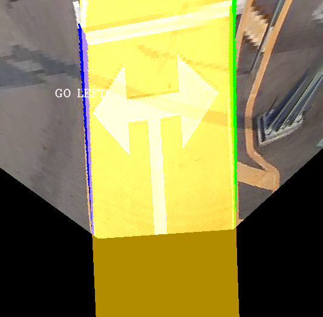

# CLRNet_research


## Introduction
CLRNet을 이용하여 custom data의 차선을 추출하고 Inverse Perspective Mapping을 이용하여 차량과 차선의 중앙 값을 구하는 코드
(https://velog.io/@jinhoyoho/%EC%9E%90%EC%9C%A8%EC%A3%BC%ED%96%89-CLRNet-%EC%A0%81%EC%9A%A9%ED%95%B4%EB%B3%B4%EA%B8%B0)

## Installation

### Prerequisites
Ubuntu20.04으로 실행가능
- Python = 3.8 
- Pytorch = 1.8.0
- CUDA = 11.1
- 로 실행하였으며 다른 필요한 것들은 `requirements.txt`에서 설치가능


### Clone this repository
```Shell
git clone https://github.com/jinhoyoho/CLRNet_research.git
```

### Create a conda virtual environment and activate it (conda is optional)

```Shell
## Conda 실행
conda create -n clrnet python=3.8 -y
conda activate clrnet

## 필요한 python pkg 설치
pip install -r requirements.txt

## pytorch 및 cuda 설치
torch==1.8.0+cu111 torchvision==0.9.0+cu111 torchaudio==0.8.0 -f https://download.pytorch.org/whl/torch_stable.html
```

### Download pth file
용량이 너무 크기 때문에 github에 pth파일을 업로드 할 수 없다.
따라서 아래의 링크를 통해서 pth 파일을 다운로드 해야한다.
https://1drv.ms/u/s!AvdDTPBzW74B_HL9dqXCWHel6S1J?e=31fIpN  (resnet34_tusimple)

### Running
```Shell
## 아래 코드를 실행하여 CLRNet을 실행할 준비를 해야함 (최초 한 번만 실행!)
python setup.py build develop

## 실행
python detect_lane.py
```

실행하면 'result.png'와 같이 결과를 얻을 수 있다.

외부 파라미터 값을 정확히 맞춰줘야 정확한 Bird Eye View (BEV)를 얻을 수 있다.

### Result

- original 사진


- IPM을 이용한 BEV 사진


- original curve 사진


- BEV curve 사진

## original site
### CLRNet: Cross Layer Refinement Network for Lane Detection
https://github.com/Turoad/CLRNet

## Reference site
### Inverse Perspective Mapping을 이용한 Bird Eye View 변환
https://gaussian37.github.io/vision-concept-ipm/
